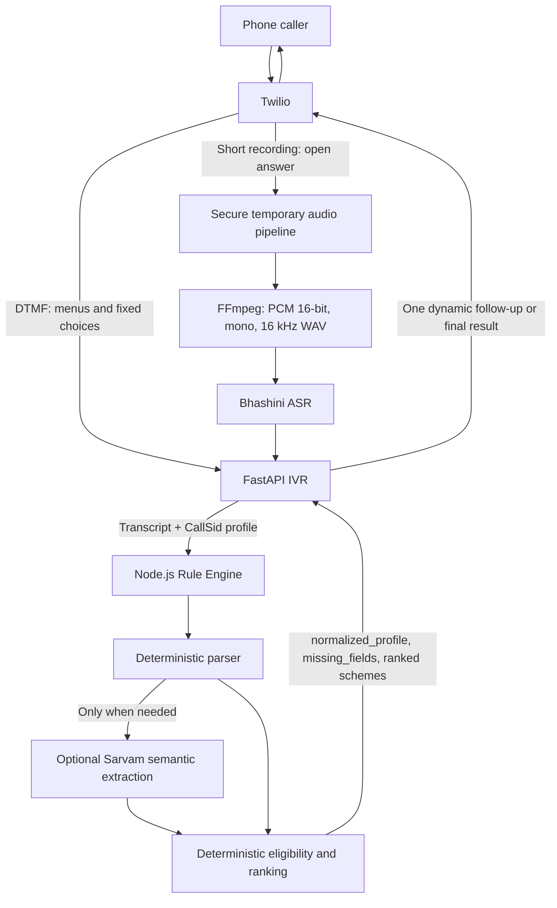

# SAARTHI-SETU IVR Prototype

SAARTHI-SETU is a multilingual telephone interface that helps marginalized entrepreneurs discover government financing schemes. A caller describes their business and profile naturally, the IVR collects only information still required by the deterministic backend, and the final eligible schemes are spoken over the call.

This repository contains the Python/FastAPI and Twilio orchestration layer. Scheme eligibility, scoring, ranking, and financial simulation remain exclusively in the separate [`Rule-Engine`](https://github.com/SIH-2026-Org/Rule-Engine) service.

## Architecture



The AI services understand speech and extract facts. They never select schemes or decide eligibility.

## Capabilities

- Hindi and English language selection
- Twilio DTMF menus and TTS
- Bhashini ASR for open-ended recorded answers
- Twilio speech recognition as a safe fallback
- Multi-turn sessions keyed by Twilio `CallSid`
- Dynamic questions driven only by DRE `missing_fields`
- Batched related questions when callback budget is limited
- DTMF for gender, social category, business status, area type, and PIN code
- Deterministic numeric parsing before STT confidence rejection
- Variable-length keypad fallback for ambiguous amounts
- Pincode resolver abstraction with spoken-state fallback
- Up to three structured eligible recommendations with optional EMI narration
- Session expiry, retry limits, callback limits, and sanitized debug output

## Verified live call

A real English Twilio call successfully completed the full flow:

1. The caller supplied age, gender, category, state, dairy activity, annual income, loan requirement, and new-business intent in one utterance.
2. The DRE preserved those facts and returned `NEEDS_MORE_INFO` with only `project_cost` missing.
3. The caller answered `12000 rupees`. Although Twilio reported low confidence (`0.2377`), the field-aware deterministic parser accepted the single unambiguous value without calling Sarvam.
4. The DRE returned `OK` and the IVR spoke the actual ranked results.

Sanitized terminal result from that run:

```text
STATUS: OK

NORMALIZED PROFILE
age: 28
gender: M
social_category: SC
state: Rajasthan
activity: dairy
income_annual: 100000
project_cost: 12000
loan_required: 100000
existing_business: false

ELIGIBLE RANKED SCHEMES: 2
1. Kisan Credit Card Scheme — score 97 — estimated EMI ₹221
2. Pradhan Mantri Mudra Yojana - Shishu — score 72 — estimated EMI ₹269
```

This is a recorded example, not a hardcoded recommendation. Results always come from the current Rule Engine data and the caller's normalized profile.

## Repository structure

```text
app.py                    FastAPI routes and TwiML rendering
conversation_manager.py   Multi-turn state machine and DRE orchestration
numeric_answers.py        Deterministic field-aware numeric parsing
question_bank.py          Central English/Hindi prompts
turn_planner.py           Missing-field priority and safe batching
session_store.py          In-memory CallSid sessions with TTL
dre_client.py             Async Rule Engine client
audio_pipeline.py         Twilio download and temporary FFmpeg conversion
bhashini_provider.py      Bhashini ASR adapter
speech_provider.py        Twilio transcript adapter
location_service.py       Pincode resolver abstraction
debug_output.py           Sanitized final-match terminal formatting
scripts/                   Smoke and simulation utilities
tests/                     Automated unit and route tests
```

## Prerequisites

- Python 3.11 or newer
- FFmpeg
- A running SAARTHI-SETU Rule Engine
- Twilio account and voice-capable number
- Public HTTPS tunnel such as ngrok for local phone testing
- Bhashini credentials when `SPEECH_PROVIDER=bhashini`

## Setup

```bash
git clone https://github.com/SIH-2026-Org/IVR-Prototype.git
cd IVR-Prototype

python3 -m venv .venv
source .venv/bin/activate
pip install -r requirements.txt

cp .env.example .env
```

Fill the required values in `.env`. Never commit this file.

```env
PUBLIC_BASE_URL=https://your-public-domain.example
DRE_URL=http://localhost:3000/api/v1/match

SPEECH_PROVIDER=bhashini
TWILIO_ACCOUNT_SID=
TWILIO_AUTH_TOKEN=

BHASHINI_ENABLED=true
BHASHINI_UDYAT_KEY=
BHASHINI_INFERENCE_KEY=
BHASHINI_ASR_SERVICE_ID=
```

All supported configuration variables and safe defaults are documented in [`.env.example`](.env.example).

## Run locally

Start the Node Rule Engine first:

```bash
cd ../Rule-Engine
npm install
npm run dev
```

Start the IVR in another terminal:

```bash
cd ../IVR-Prototype
source .venv/bin/activate
uvicorn app:app --host 0.0.0.0 --port 8000 --reload
```

Expose FastAPI through HTTPS:

```bash
ngrok http 8000
```

Set `PUBLIC_BASE_URL` to the current HTTPS URL and configure the Twilio incoming-call webhook:

```text
POST https://your-public-domain.example/ivr
```

## Manual phone test

Call the configured Twilio number, select English, and choose scheme matching. Say:

> I am a 28-year-old man from the SC category, living in Rajasthan. I want to start a new dairy business. My annual family income is one lakh rupees. The total project cost is one lakh twenty thousand rupees, and I need a loan of one lakh rupees.

The terminal should show the transcript, normalized profile, DRE status, and actual eligible recommendations. If a value is missing, the IVR asks only one DRE-requested field, or a related pair when the callback budget is tight.

For an unambiguous numeric follow-up, answers such as `120000`, `2 lakh`, or `one lakh twenty thousand` are accepted even if Twilio confidence is low. An ambiguous answer such as `100000 20000` switches to keypad entry; enter the amount and press `#`.

## Tests

Run the complete Python suite:

```bash
source .venv/bin/activate
python -m unittest discover -s tests -v
```

Run the Rule Engine tests from its repository:

```bash
npm test
```

The automated tests mock paid telephony and external ASR calls. They cover sessions, retries, DTMF, callback planning, numeric parsing, audio conversion, Bhashini requests, DRE failures, and final recommendation filtering.

## Bhashini smoke test

The smoke script reads credentials from `.env` and never embeds them:

```bash
python scripts/test_bhashini_asr.py path/to/16khz-mono-pcm16.wav --language hi
```

## Security and privacy

- `.env`, virtual environments, Python caches, audio files, and recording directories are ignored by Git.
- Twilio recordings are downloaded with environment-provided credentials.
- Audio is converted in temporary files and deleted after processing.
- API keys, authorization headers, phone numbers, and recording URLs are excluded from application debug output.
- Raw audio is not retained by this service.

## Current prototype limitations

- Sessions are held in memory and should move to Redis for multiple production workers.
- True streaming speech requires Twilio Media Streams and a realtime ASR adapter; this prototype processes short recordings.
- Bhashini availability and language-specific pipeline IDs depend on external configuration.
- The pincode provider can be unavailable, in which case the IVR asks for the state by speech.
- Document guidance and partner-routing menu options remain placeholders.
